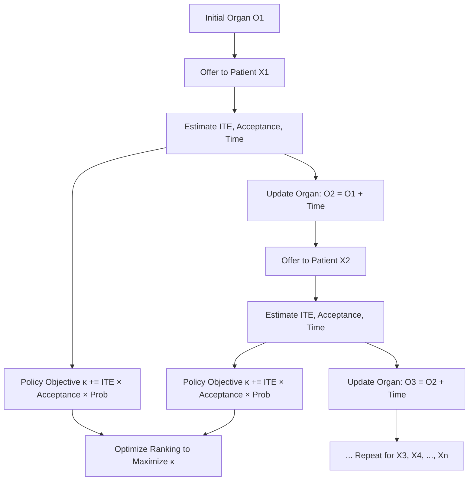

# DynamITE: Optimal Time-Sensitive Organ Offers Using ITE

**DynamITE** is a novel organ allocation methodology that explicitly models patient offer acceptance dynamics, cold ischemic times (CIT), and individual treatment effects (ITE) to optimize match-runs in organ transplantation. This approach improves both early organ acceptance and long-term patient outcomes.

---

## 🧠 Motivation

Traditional organ allocation systems prioritize patients based on urgency or expected benefit, neglecting:
- Offer turndown behaviors
- Sequential decision dynamics
- Time-dependent organ quality (CIT)

This often results in:
- Organ nonuse
- Prolonged decision times
- Reduced transplant success

**DynamITE** addresses these issues through dynamic modeling of both decision time and acceptance behavior to increase placement efficiency.

---

## 🚀 Key Features

- **Dynamic Matching Algorithm**  
  Dynamically updates organ characteristics (CIT) after each turndown using a sequence-aware update function.

- **PatientNet**  
  A multi-task neural network that estimates:
  - Probability of organ acceptance
  - Decision time for acceptance

- **ITE Estimation with OrganITE**  
  Estimates the patient-specific benefit of accepting a given organ.

- **Search-Enhanced Optimization**  
  A local search algorithm improves initial rankings based on a closed-form benefit function κ.

---

## 🏗️ Architecture

See the *problem setting diagram* in the paper (Figure 1, page 2) for a visual explanation.
